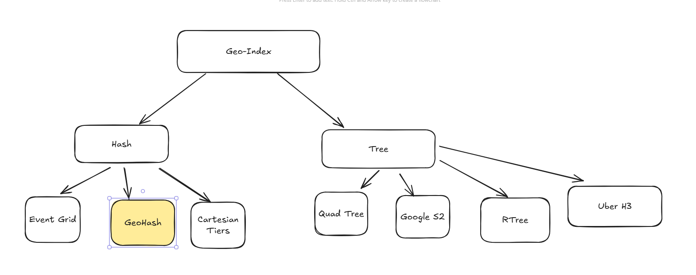
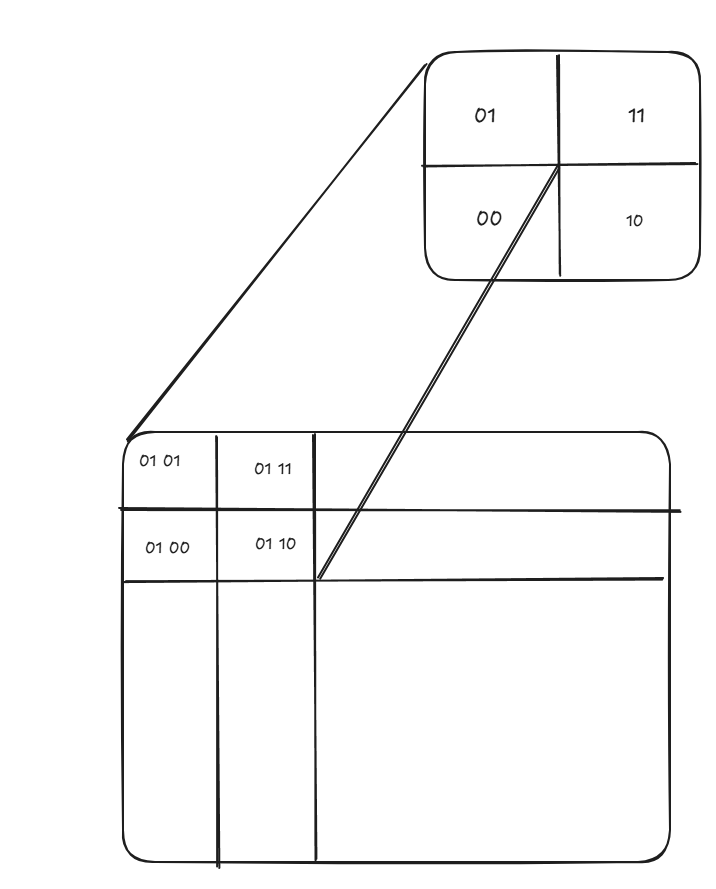

# GeoHashing


## Overview

We can use SQL to store latitude and longitude in separate columns and index them. However, searching in two columns can have a time complexity of \(O(n^2)\). To optimize this, we can use various techniques to map 2D space into a more efficient structure.


### Common Approaches

1. **Google S2**: Maps the globe to a cube and recursively divides it into smaller cells. Each location is assigned a unique `cellID`.
2. **Uber H3**: Similar to a quadtree but uses hexagonal divisions for better spatial representation.
3. **R-tree/GiST**: Used by PostgreSQL. It is highly granular and accurate, avoiding neighboring cell issues. However, it is complex and better suited for static locations.

### GeoHashing

GeoHashing is a scalable and less complex way to store and search spatial data by converting 2D space into a string representation. It divides the 2D space into quadrants recursively and maps them to a string.

---

## Step-by-Step Example

Let’s encode the coordinates for **San Francisco, CA**:
- **Latitude**: 37.7749
- **Longitude**: -122.4194

### 1. Initial Ranges
- Latitude: \([-90, +90]\)
- Longitude: \([-180, +180]\)

### 2. Binary Subdivision
Alternate between longitude and latitude. For each bit:
- Split the range in half.
- If the coordinate is above the midpoint, set the bit to `1` and use the upper half.
- If below, set the bit to `0` and use the lower half.

**Example (First Few Steps):**

| Step | Range         | Split          | Value         | Bit         |
|------|---------------|----------------|---------------|-------------|
| 1    | Longitude     | -180 to 0      | -122.4194 < 0 | Upper half  |
| 2    | Latitude      | -90 to 0       | 37.7749 > 0   | Upper half  |
| 3    | Longitude     | -180 to -90    | -122.4194 > -135 | Upper half  |
| 4    | Latitude      | 0 to 90        | 37.7749 < 45  | Lower half  |
| ...  | ...           | ...            | ...           | ...         |

### 3. Interleave Bits
Combine longitude and latitude bits alternately.

### 4. Base32 Encoding
- Group bits into 5-bit chunks.
- Convert each chunk to a Base32 character.

**Example Output:**
- For San Francisco, the GeoHash is:
  - **"9q8yy"** (short precision)
  - **"9q8yyz0r"** (higher precision)

---

## Flowchart

```mermaid
flowchart TD
    A[Start with Lat/Lon] --> B[Divide Longitude Range]
    B --> C[Divide Latitude Range]
    C --> D[Assign Bit (0 or 1)]
    D --> E[Interleave Bits]
    E --> F[Group into 5-bit Chunks]
    F --> G[Encode to Base32]
    G --> H[GeoHash String]
```    


## Benefits of GeoHashing

- **Partitioning Key**:  
  GeoHash strings can be used as partitioning keys in distributed databases like Cassandra and DynamoDB. This helps cluster nearby locations together, improving the performance of queries for nearby places.

- **Sorted Index Key**:  
  GeoHash strings are precision-based and can be used as sorted index keys in SQL databases. This enables faster searches for nearby places by leveraging the natural ordering of GeoHash strings.

- **Scalability**:  
  GeoHashing is computationally efficient and scalable, making it suitable for large-scale spatial data storage and retrieval.

- **Proximity Search**:  
  GeoHashing allows for efficient proximity searches by comparing prefixes of GeoHash strings. Locations with similar prefixes are geographically close.

- **Compact Representation**:  
  GeoHashing converts latitude and longitude into a compact string representation, reducing storage requirements compared to storing raw coordinates.

- **Hierarchical Precision**:  
  GeoHashing supports variable precision levels, allowing for flexible granularity in spatial queries. Shorter GeoHash strings represent larger areas, while longer strings represent smaller, more precise areas.

- **Cross-Platform Compatibility**:  
  GeoHashing is a widely adopted standard and can be used across different platforms and programming languages.

## Drawbacks of GeoHashing

- **Loss of Precision in Edge Cases**:
  GeoHashing can cause inaccuracies for locations near the boundaries of GeoHash cells, as nearby points may fall into different cells despite being geographically close.

- **Non-Uniform Cell Sizes**:
  GeoHashing divides the globe into quadrants, which can result in non-uniform cell sizes near the poles due to the curvature of the Earth.

- **Limited Proximity Search**:
  While GeoHashing supports prefix-based proximity searches, it struggles with more complex spatial queries, such as finding all points within a circular radius.

- **String Length Trade-Off**:
  Higher precision requires longer GeoHash strings, which can increase storage and indexing costs.

- **Not Suitable for Dynamic Data**:
  GeoHashing is less effective for datasets with frequently changing spatial data, as recalculating GeoHashes can be computationally expensive.

- **Inefficient for Large Areas**:
  GeoHashing is optimized for small, localized searches. For large-area queries, it may require combining multiple GeoHash cells, which can be inefficient.

- **Lack of True Spatial Awareness**:
  GeoHashing does not inherently account for the Earth's spherical shape, leading to distortions in distance calculations and spatial relationships.

### Loss of Precision in Edge Cases

**Loss of Precision in Edge Cases** refers to the inaccuracies that occur in GeoHashing when locations are near the boundaries of GeoHash cells. Since GeoHashing divides the 2D space into discrete cells, two geographically close points might fall into different cells if they are near a boundary. This can lead to:

- **False Negatives in Proximity Searches**: Nearby points may not share the same GeoHash prefix, making it harder to identify them as close neighbors.

- **Reduced Accuracy**: The representation of spatial data becomes less precise for points near cell edges, as the division does not account for their actual proximity.


# Algorithm to Get Neighboring Cells

## Input
- A GeoHash string.

## Steps

1. **Identify Neighbor Directions**:
   - Define the 8 possible neighbors:
     - North
     - South
     - East
     - West
     - North-East
     - North-West
     - South-East
     - South-West

2. **Decode the GeoHash**:
   - Convert the GeoHash string into its latitude and longitude range.

3. **Calculate Neighboring Ranges**:
   - Adjust the latitude and longitude ranges to move in the direction of each neighbor.

4. **Encode Neighboring Ranges**:
   - Convert the adjusted latitude and longitude ranges back into GeoHash strings.

5. **Output**
- A list of GeoHash strings representing the neighboring cells.

This issue is inherent to the grid-based nature of GeoHashing.
**Reference**: [YouTube Video](https://youtu.be/S7E-GhQLNnM?si=un3r2_kx2J-JfKMP)


java:
<dependency>
    <groupId>ch.hsr</groupId>
    <artifactId>geohash</artifactId>
    <version>1.4.0</version>
</dependency>