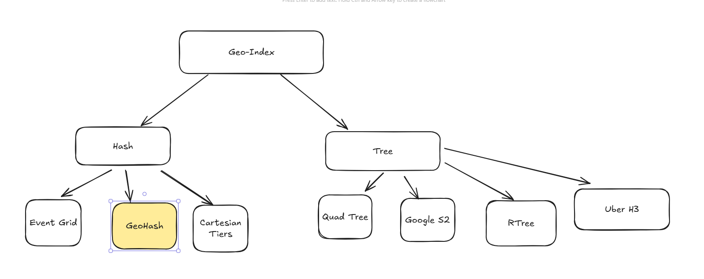

refer: https://youtu.be/S7E-GhQLNnM?si=un3r2_kx2J-JfKMP

We can use SQL to store the Latitude and longitude in separate columns and index those

Any Search in the 2 columns will have o(n^2)

We have few ways to do this.
All the below ways involve breaking downd the 2D space recurrsively and then mapping it.(QuadTree)

google s2 -> maps the globe to a cube and then recurrsively get to a small cell and the location is assigned cellID 
Uber h3 is similar to Quad but the divisions are hexagonal.

R-tree/GIST -> used by postgres. very granular and accurate. no issues with neighbouring cells issue. Is complex and is generally good for ststic locations.

In this Article, we will discuss about GeoHash.
very scalable and not so complex way to store and search by converting a 2D space to  String.

there are 2 main issues which will be discussed.

