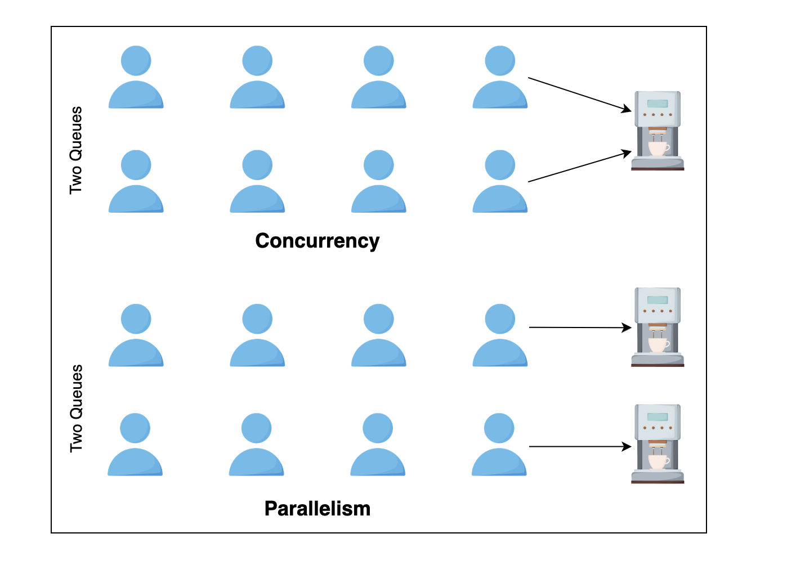
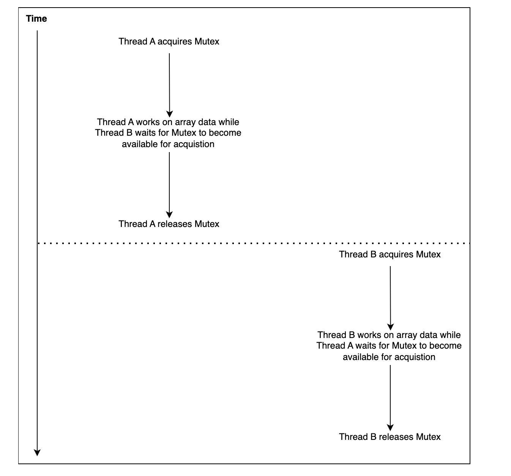

#### Program:
A program is a set of instructions and associated data that resides on the disk and is loaded by the operating system to perform some task. An executable file or a python script file are examples of programs.

#### Process:
* A process is a program in execution. 
* A process is an ***execution environment*** that consists of 
***instructions, user-data, and system-data segments,*** 
as well as lots of other ***resources such as CPU, memory, address-space, disk and network I/O***
acquired at runtime.  
* A program can have several copies of it running at the same time but 
a process necessarily belongs to only one program.

#### Thread:
* Thread is the smallest unit of execution in a process. 
* A thread simply executes instructions serially. 
* A process can have multiple threads running as part of it. 
* Usually, there would be some state associated with the process 
that is shared among all the threads 
and in turn each thread would have some state private to itself
* The ***globally shared state*** amongst the threads of a process is ***visible and accessible to all the threads***.
* Special attention needs to be paid when any thread tries to read or write to this global shared state.
* There are several constructs offered by various programming languages to guard and discipline the access to this global state.

## Concurrency
* A system capable of running several distinct programs or more than one independent unit of the same program in overlapping time intervals is called a concurrent system. 
* The execution of two programs or units of the same program may not happen simultaneously.
* A concurrent system can have two programs in progress at the same time where progress doesn’t imply execution. 
* One program can be suspended while the other executes. 
* Both programs are able to make progress as their execution is interleaved. 
* In concurrent systems, the goal is to maximize throughput and minimize latency. For example, a browser running on a single core machine has to be responsive to user clicks but also be able to render HTML on screen as quickly as possible. Concurrent systems achieve lower latency and higher throughput when programs running on the system require frequent network or disk I/O.

## Parallelism

* A parallel system is one which necessarily has the ability to execute multiple programs at the same time. 
* Usually, this capability is aided by hardware in the form of multicore processors on individual machines or as computing clusters where several machines are hooked up to solve independent pieces of a problem simultaneously. 

**In the case of an operating system, if it runs on a machine with say four CPUs then the operating system can execute four tasks at the same time, making execution parallel. Either a single (large) problem can be executed in parallel or distinct programs can be executed in parallel on a system supporting parallel execution.**

**Concurrency by employing one of the following multitasking models:**

In ***preemptive multitasking***:, 
* the operating system preempts a program to allow another waiting task to run on the CPU. 
* Programs or threads can't decide how long for or when they can use the CPU. 
* The operating system’s scheduler decides which thread or program gets to use the CPU next and for how much time.
* the programmer isn't burdened to decide when to give up control back to the CPU in code.

## Synchronous

* Synchronous execution refers to line-by-line execution of code. 
* If a function is invoked, the program execution waits until the function call is completed. 
* Synchronous execution blocks at each method call before proceeding to the next line of code.

## Asynchronous

* Async execution can invoke a method and move onto the next line of code without waiting for the invoked function to complete or receive its result. Usually, such methods return an entity sometimes called a future or promise that is a representation of an in-progress computation.
* Another pattern is to pass a callback function to the asynchronous function call which is invoked with the results when the asynchronous function is done processing.
* Asynchronous programming is an excellent choice for applications that do extensive network or disk I/O and spend most of their time waiting.

## Mutex vs Semaphore

### Mutex :

its short form of **Mutual Exclusion**.
* A mutex is used to guard shared data such as a linked-list, an array or any primitive type. A mutex allows only a single thread to access a resource or critical section.
* Once a thread acquires a mutex, all other threads attempting to acquire the same mutex are blocked until the first thread releases the mutex. 
* Once released, most implementations arbitrarily chose one of the waiting threads to acquire the mutex and make progress.

**Mutex Daigramatically :**

### Semaphore :

* Semaphore, on the other hand, is used for limiting access to a collection of resources
* Think of semaphore as having a limited number of permits to give out. 
* If a semaphore has given out all the permits it has, then any new thread that comes along requesting for a permit will be blocked, till an earlier thread with a permit returns it to the semaphore. 
* A typical example would be a pool of database connections that can be handed out to requesting threads.
* A semaphore with a single permit is called a **binary semaphore** 

** Semaphores can also be used for signaling among threads.  
This is an important distinction as it allows threads to cooperatively work towards completing a task.  
A mutex, on the other hand, is strictly limited to serializing access to shared state among competing threads.**

|Feature |Mutex |Semaphore
|---|---|---|
|Access Control|Only one thread at a time|Multiple threads (if counting semaphore)|
|Ownership|The thread that locks must unlock|Any thread can release the semaphore|
|Use Case|Protecting a single resource|Managing multiple resources|
|Blocking Behavior|Blocks other threads until unlocked|Blocks when resource count reaches zero|
|Types|Only one (binary lock)|Binary & Counting Semaphores|
|Complexity|Simpler|More flexible but requires careful handling|
|signaling|Signaling to other Threads not present|Signaling and release of resources can be done|

## Monitor

What is a Monitor?

A Monitor is a high-level synchronization construct that ensures mutual exclusion and coordination between threads in a multithreaded program. It is a combination of: 
1.	**A Mutex (Locking Mechanism)** → Ensures only one thread can execute the critical section at a time.
2.	**Condition Variables (Waiting & Signaling Mechanism)** → Allows threads to wait until a condition is met and be notified when they can proceed.

Monitors simplify thread synchronization by automatically handling locks and providing a mechanism for thread coordination.

**How a Monitor Works**

A Monitor has:  
* **A Lock (Mutex)** → Ensures only one thread can execute at a time.
* **Condition Variables&& → Used to put a thread to sleep when a condition is not met and wake it up later.

Monitor States:
1.	**Entry (Waiting)** → A thread requests access.
2.	**Execution (Locked)** → The thread is inside the monitor and executes code.
3.	**Waiting (Condition Variable)** → The thread sleeps inside the monitor until a condition is met.
4.	**Exit (Unlocking)** → The monitor releases the lock, allowing other threads to enter.

**JAVA SYNCHRONIZED KEYWORD IMPLEMENTS A MONITOR**

