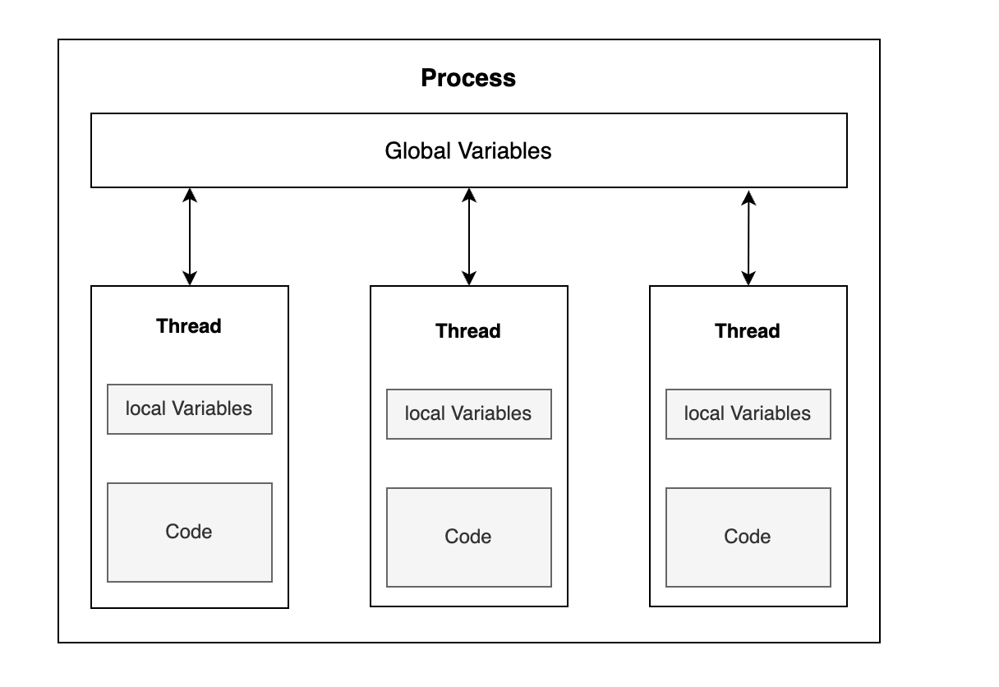

#### Program:
A program is a set of instructions and associated data that resides on the disk and is loaded by the operating system to perform some task. An executable file or a python script file are examples of programs.

#### Process:
* A process is a program in execution. 
* A process is an ***execution environment*** that consists of 
***instructions, user-data, and system-data segments,*** 
as well as lots of other ***resources such as CPU, memory, address-space, disk and network I/O***
acquired at runtime.  
* A program can have several copies of it running at the same time but 
a process necessarily belongs to only one program.

#### Thread:
* Thread is the smallest unit of execution in a process. 
* A thread simply executes instructions serially. 
* A process can have multiple threads running as part of it. 
* Usually, there would be some state associated with the process 
that is shared among all the threads 
and in turn each thread would have some state private to itself
* The ***globally shared state*** amongst the threads of a process is ***visible and accessible to all the threads***.
* Special attention needs to be paid when any thread tries to read or write to this global shared state.
* There are several constructs offered by various programming languages to guard and discipline the access to this global state.

## Concurrency
* A system capable of running several distinct programs or more than one independent unit of the same program in overlapping time intervals is called a concurrent system. 
* The execution of two programs or units of the same program may not happen simultaneously.
* A concurrent system can have two programs in progress at the same time where progress doesn’t imply execution. 
* One program can be suspended while the other executes. 
* Both programs are able to make progress as their execution is interleaved. 
* In concurrent systems, the goal is to maximize throughput and minimize latency. For example, a browser running on a single core machine has to be responsive to user clicks but also be able to render HTML on screen as quickly as possible. Concurrent systems achieve lower latency and higher throughput when programs running on the system require frequent network or disk I/O.

