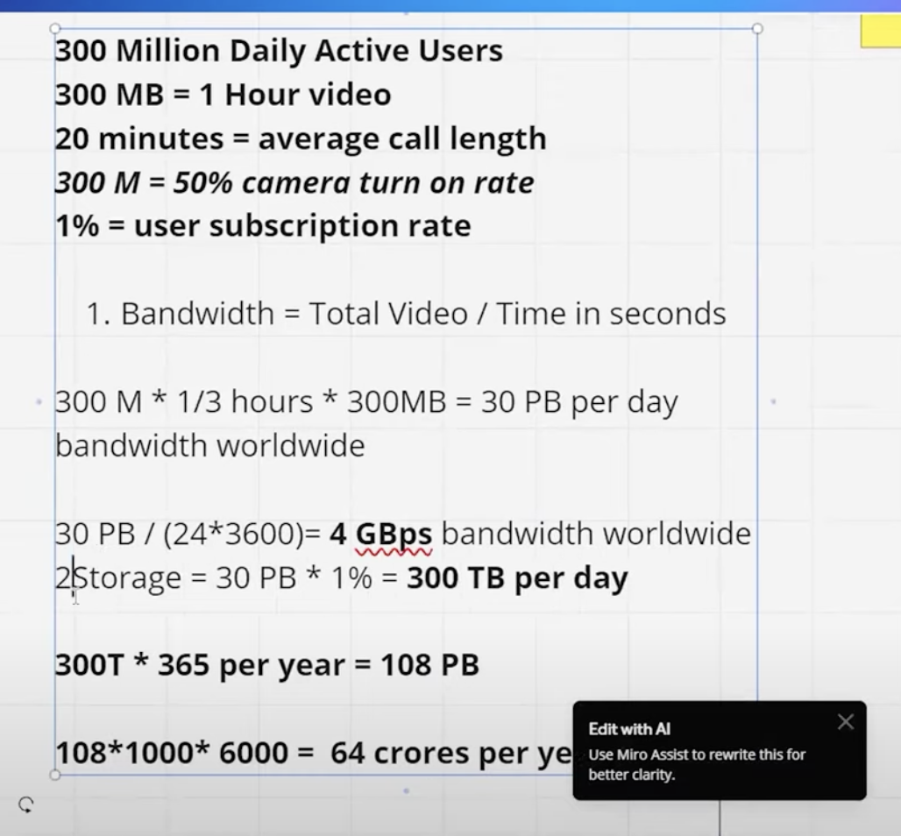

## Technical Details

### Understanding Symmetric NAT

🔴 **Symmetric NAT is the most restrictive type of NAT, creating a distinct public IP + port mapping for each external destination.**

📌 How Symmetric NAT Functions

1️⃣ A device behind the NAT (for example, 192.168.1.10) initiates a connection to an external server.  
2️⃣ The NAT assigns a random public port for this connection (e.g., 203.0.113.5:45678).  
3️⃣ If the same device attempts to connect to a different server, a new random port is allocated (e.g., 203.0.113.5:56789).  
4️⃣ These public IP + port mappings are unique for each destination and cannot be reused by other peers.

Example: Symmetric NAT Port Allocation

|Internal IP |Private Port |External IP| Public Port |Destination|
|---|---|---|---|---|
|192.168.1.10 |5000 |203.0.113.5 |45678 |Google.com|
|192.168.1.10 |5000 |203.0.113.5 |56789 |YouTube.com|


### How Symmetric NAT Disrupts P2P Communication

For direct P2P communication, both peers need to identify and utilize each other’s public IP + port (via STUN). However, Symmetric NAT complicates this process:

1️⃣ Peer A receives a public IP + port (e.g., 203.0.113.5:45678) when it communicates with a STUN server.  
2️⃣ Peer B also obtains its own public IP + port.  
3️⃣ 🔴 If Peer B attempts to send data to Peer A at 203.0.113.5:45678, the NAT blocks the connection because the port was designated solely for the STUN server, not for Peer B.

------------------------------------------------------------------------

### WebRTC

How WebRTC Operates:
1. User A and User B establish a connection through a signaling server (using WebSocket, HTTP, or another protocol).  
2. Users exchange SDP (Session Description Protocol) messages.  
3. ICE candidates are shared to set up a connection.  
4. A peer-to-peer connection is formed utilizing RTCPeerConnection.  
5. Media and data are transmitted directly between users.


* Utilizes UDP for quicker delivery
* Some packet loss is acceptable

For peer-to-peer video transfer, we can leverage **WebRTC (Web Real-Time Communication).**

### The Three Core APIs of WebRTC:
1. **getUserMedia (Media Capture API)**
   * Grants access to media devices (camera, microphone, screen) to capture audio and video streams.
   * Returns a MediaStream object that can be linked to HTML elements such as video or audio.

2. **RTCPeerConnection (P2P Connection API)**
   * Establishes a direct connection between peers.
   * Facilitates network traversal (bypassing NAT and firewalls).
   * Manages audio/video encoding, encryption, and transmission.
   * Employs protocols like SRTP (Secure Real-Time Protocol) for media encryption.
   
3. **RTCDataChannel (P2P Data API)**
   * Allows direct transfer of arbitrary data between peers (e.g., file transfers, chat messages).
   * Supports both TCP-like reliable transmission and UDP-like unreliable transmission.

```

User A                 Signaling Server                User B
   |                            |                           |
   | ---- Connect to Server --> |                           |
   |                            | <-- Connect to Server ----|
   | ---- Send SDP Offer -----> | ---- Forward Offer -----> |
   |                            |                           |
   | <--- Receive SDP Answer -- | <---- Send SDP Answer --- |
   |                            |                           |
   | ---- Send ICE Candidate -> | ---- Forward Candidate -> |
   | <--- Receive ICE Candidate | <---- Send ICE Candidate  |
   |                            |                           |
   |------ P2P Connection Established -------> User B      |
   |                           |                           |
   |----- Direct Media/Data Transfer 🔄 🔄 🔄 -----> |


```

* **WebRTC relies on SDP and ICE to facilitate peer-to-peer communication.** 
* **These two mechanisms enable peers to articulate media capabilities and determine the optimal connection method.**
* **They ensure effective communication between two users over the internet, even when behind NATs or firewalls.**

### SDP (Session Description Protocol)

**SDP** serves as a format for outlining multimedia communication sessions in WebRTC. It encompasses details regarding media type, codec, network transport, and session metadata, allowing two peers to negotiate the parameters necessary for a WebRTC connection.

* Indicates whether the session will include audio, video, or both.
* Specifies codecs (e.g., VP8, H.264 for video; Opus for audio).
* Provides network transport specifications (e.g., RTP, RTCP).
* Assists peers in negotiating and establishing a compatible media session.

Sample Example:

```
v=0
o=- 4611733015982286200 2 IN IP4 127.0.0.1
s=-
t=0 0
a=group:BUNDLE audio video
m=audio 9 UDP/TLS/RTP/SAVPF 111 103 104
a=rtcp-mux
a=rtpmap:111 opus/48000/2
m=video 9 UDP/TLS/RTP/SAVPF 96 97 98
a=rtpmap:96 VP8/90000

```


### ICE (Interactive Connectivity Establishment)

ICE is a framework designed for NAT traversal that aids WebRTC clients in identifying the optimal network path for peer-to-peer communication. Given that many users are situated behind firewalls or NATs, direct communication is not always feasible. ICE works to locate the best route for WebRTC traffic.

How ICE Functions in WebRTC:
1. Gather ICE candidates (potential network addresses).
2. Exchange ICE candidates via the signaling server.
3. Test connectivity to determine which candidate is the most effective.
4. Establish the WebRTC connection using the most suitable candidate.


The following protocols are utilized:

|Feature |RTP |RTSP |RTCP|
|---|---|---|---|
|Purpose|Media transmission|Stream control|Performance monitoring|
|Function|Transports audio/video data|Controls streaming (Play/Pause)|Provides feedback on RTP quality|
|Used In|WebRTC, VoIP, Live Streaming|IP Cameras, Video Streaming|WebRTC, VoIP, Streaming Quality Reports|
|Protocol Type|Transport|Control|Control|
|Works With|RTCP|RTP|RTP|

### STUN (Session Traversal Utilities for NAT)

STUN is a lightweight protocol that helps a WebRTC client discover its public IP address and port as seen by external servers. This is crucial for establishing direct P2P communication when both users are behind NATs.

### How STUN Works in WebRTC
1.	User A contacts a STUN server to determine its public IP and port.
2.	The STUN server responds with the public IP and port.
3.	User A sends this information to User B via a signaling server.
4.	If User B is also behind a simple NAT, it does the same process.
5.	Both users use this public information to establish a direct P2P connection.

```

candidate:1862277376 1 udp 33562367 203.0.113.1 3478 typ srflx raddr 10.0.0.1 rport 5000
```

### TURN (Traversal Using Relays around NAT)

TURN is a more advanced protocol than STUN. It acts as a relay server for WebRTC when direct P2P communication is not possible due to strict firewalls or Symmetric NATs.

#### How TURN Works in WebRTC
1.	User A and User B send their media streams to a TURN server.
2.	The TURN server relays the media between both users.
3.	This allows communication even when direct connections fail.

📌 TURN servers act as a fallback mechanism when STUN fails. However, TURN requires more bandwidth and is costly to operate.

```

candidate:3123456789 1 udp 2122260223 198.51.100.1 5000 typ relay


```

|Feature |STUN |TURN |Purpose|
|---|---|---|---|
|Discovers public IP & port|Relays media when direct connection fails|NAT Type Support|Works with most NATs|
|Works even with Symmetric NAT|Media Routing|Direct peer-to-peer|Uses a relay server|
|Performance|Faster, low latency|Slower, higher latency|Bandwidth Usage|
|Low|High (since it relays data)|Cost|Free or low cost|Expensive to maintain|


***TURN servers act as a fallback mechanism when STUN fails. However, TURN requires more bandwidth and is costly to operate.***</br>
Coturn can be used to setup the STUN/TURN.

* STUN helps clients discover their public IP for direct connections.
* TURN relays media when direct connections fail (Symmetric NAT, strict firewalls).
* Coturn is a powerful open-source STUN/TURN server.
