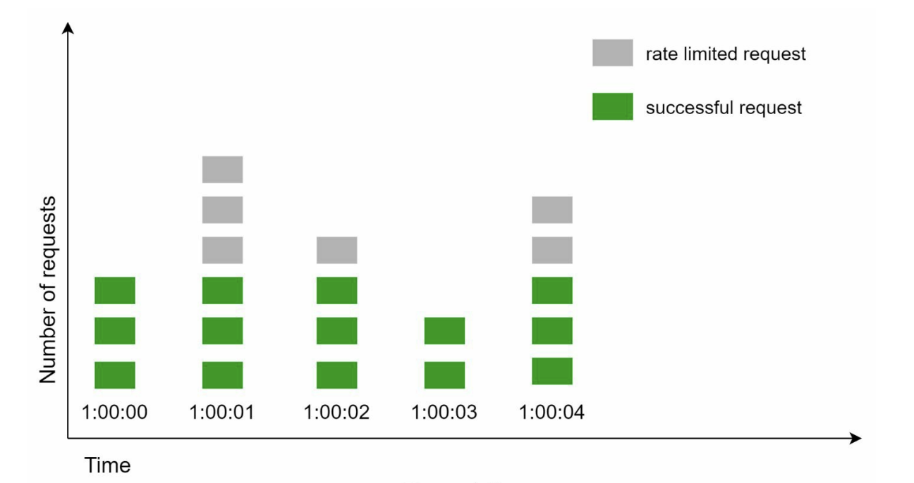
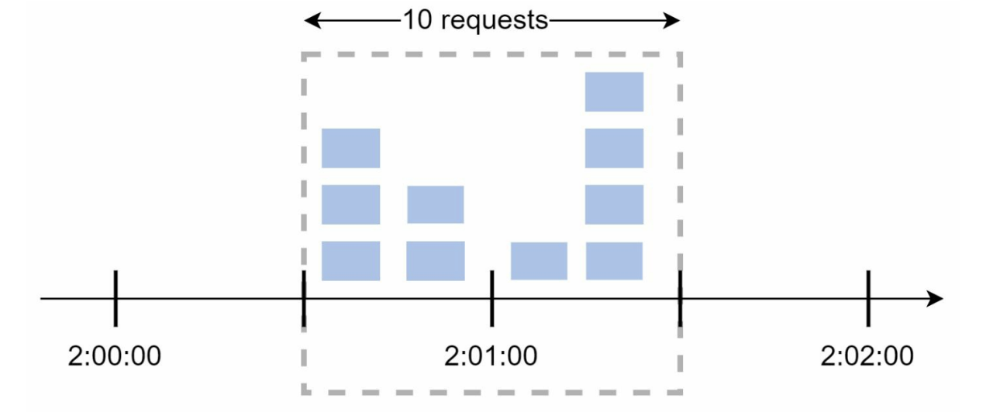

Rate limiting can be implemented using different algorithms, each with its pros and cons. The
interactions between an interviewer and a candidate help to clarify the type of rate limiters we
are trying to build. 
**Candidate:** What kind of rate limiter are we going to design? Is it a client-side rate limiter or
server-side API rate limiter?  
**Interviewer:** Great question. We focus on the server-side API rate limiter. 
**Candidate:** Does the rate limiter throttle API requests based on IP, the user ID, or other
properties? 
**Interviewer:** The rate limiter should be flexible enough to support different sets of throttle
rules. 
**Candidate:** What is the scale of the system? Is it built for a startup or a big company with a
large user base?  
**Interviewer:** The system must be able to handle a large number of requests.  
**Candidate:** Will the system work in a distributed environment?  
**Interviewer:** Yes.  
**Candidate:** Is the rate limiter a separate service or should it be implemented in application
code?  
**Interviewer:** It is a design decision up to you.  
**Candidate:** Do we need to inform users who are throttled?  
**Interviewer:** Yes.  
**Requirements**

###### Here is a summary of the requirements for the system:

* Accurately limit excessive requests. 
* Low latency. The rate limiter should not slow down HTTP response time. 
* Use as little memory as possible. 
* Distributed rate limiting. The rate limiter can be shared across multiple servers or
processes. 
* Exception handling. Show clear exceptions to users when their requests are throttled. 
* High fault tolerance. If there are any problems with the rate limiter (for example, a cache
server goes offline), it does not affect the entire system.

## Algorithms for rate limiting

* Token bucket 
* Leaking bucket 
* Fixed window counter 
* Sliding window log 
* Sliding window counter

### Token bucket

A token bucket is a container that has pre-defined capacity. Tokens are put in the bucket
at preset rates periodically. Once the bucket is full, no more tokens are added. As shown in
Figure 4-4, the token bucket capacity is 4. The refiller puts 2 tokens into the bucket every
second. Once the bucket is full, extra tokens will overflow

The token bucket algorithm takes two parameters:
* **Bucket size**: the maximum number of tokens allowed in the bucket 
* **Refill rate**: number of tokens put into the bucket every second

1. It is usually necessary to have different buckets for different API endpoints. For instance,
if a user is allowed to make 1 post per second, add 150 friends per day, and like 5 posts per
second, 3 buckets are required for each user.
2. If we need to throttle requests based on IP addresses, each IP address requires a bucket.
3. If the system allows a maximum of 10,000 requests per second, it makes sense to have a
   global bucket shared by all requests.

**Disadv:**  
Token bucket allows a burst of traffic for short periods. A request can go through as long
as there are tokens left.

easy O(1) implemebtation.

Best Use For : **APIs with occasional bursts**

### Leaking bucket algorithm

Works as follows :

* When a request arrives, the system checks if the queue is full. If it is not full, the request
is added to the queue.
* Otherwise, the request is dropped. 
* Requests are pulled from the queue and processed at regular intervals.

**Advantages**

* Ensures a constant and predictable request rate. 
* Helps prevent server overload. 
* Prevents bursty traffic from overwhelming a system.

**DisAdv**

* A burst of traffic fills up the queue with old req

### Fixed Predefied window counter 

* The algorithm divides the timeline into fix-sized time windows and assign a counter for
each window. 
* Each request increments the counter by one. 
* Once the counter reaches the pre-defined threshold, new requests are dropped until a new
time window starts.

Issue is the Brust of traffic at the edges.

Implementation : [FixedPredefinedWindowRateLimiter.java](..%2Fdsa%2Fsrc%2Fmain%2Fjava%2Fatlassian%2Frate_limiter%2FFixedPredefinedWindowRateLimiter.java)

**Disadsvantages:**

* Spike in traffic at the edges of a window could cause more requests than the allowed
quota to go through.

### Sliding window counter algorithm

* Instead of a fixed start and end time, it counts requests within a moving window (e.g., last 60 seconds).
* Provides a smoother rate-limiting experience.

Implementation : [SlidingWindowRateLimiter.java](..%2Fdsa%2Fsrc%2Fmain%2Fjava%2Fatlassian%2Frate_limiter%2FSlidingWindowRateLimiter.java)

* If the system handles millions of requests per second, consider a bucket-based approach 
(e.g., Fixed Window or Token Bucket) instead of storing every timestamp.
* Garbage collection (GC) impact: If millions of keys accumulate in memory, 
periodic cleanup with background threads might be useful.

