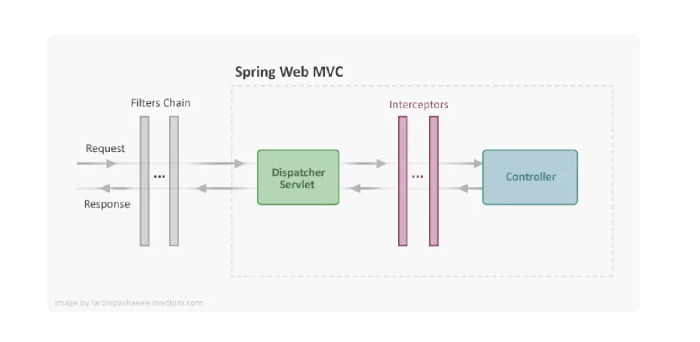

## Interceptor





Interceptor is similar to a Servlet Filter, but in contrast 
to the latter, it is located after DispatcherServlet and as a result, 
related HandlerInterceptor class configured inside the 
application context. 

***Filters are known to be more powerful, 
they are allowed to exchange the request and response objects 
handed down the chain.*** </br>

***Interceptors are just allowed to 
add some customer custom pre-processing, the option of prohibiting 
the execution, and also custom post-processing.***


## How to Use Handler Interceptors in Spring?

### 1. Implement HandlerInterceptor Interface

```java
import org.springframework.web.servlet.HandlerInterceptor;
import jakarta.servlet.http.HttpServletRequest;
import jakarta.servlet.http.HttpServletResponse;
import org.springframework.web.method.HandlerMethod;

public class MyInterceptor implements HandlerInterceptor {

    @Override
    public boolean preHandle(HttpServletRequest request, HttpServletResponse response, Object handler) throws Exception {
        System.out.println("Pre Handle method is called");
        return true;  // Return false to stop request processing
    }

    @Override
    public void postHandle(HttpServletRequest request, HttpServletResponse response, Object handler, org.springframework.web.servlet.ModelAndView modelAndView) throws Exception {
        System.out.println("Post Handle method is called");
    }

    @Override
    public void afterCompletion(HttpServletRequest request, HttpServletResponse response, Object handler, Exception ex) throws Exception {
        System.out.println("After Completion method is called");
    }
}
```

### 2. Register Interceptor in Configuration

```java

import org.springframework.context.annotation.Configuration;
import org.springframework.web.servlet.config.annotation.InterceptorRegistry;
import org.springframework.web.servlet.config.annotation.WebMvcConfigurer;

@Configuration
public class InterceptorConfig implements WebMvcConfigurer {

    @Override
    public void addInterceptors(InterceptorRegistry registry) {
        registry.addInterceptor(new MyInterceptor())
                .addPathPatterns("/api/**")  // Intercept specific paths
                .excludePathPatterns("/api/public/**"); // Exclude specific paths
    }
}
```

### Interceptor Methods Explained
1.	**preHandle()**
   * Runs before the controller method executes.
   * Returns true to continue the request or false to stop it.
   * Useful for authentication, logging, and modifying request parameters.
2.	**postHandle()**
   * Runs after the controller method executes but before the response is sent.
   * Can modify the ModelAndView if applicable.
   * Useful for adding extra model attributes or logging response time.
3.	**afterCompletion()**
   * Runs after the response is sent to the client.
   * Used for cleanup activities like closing resources or error logging.
