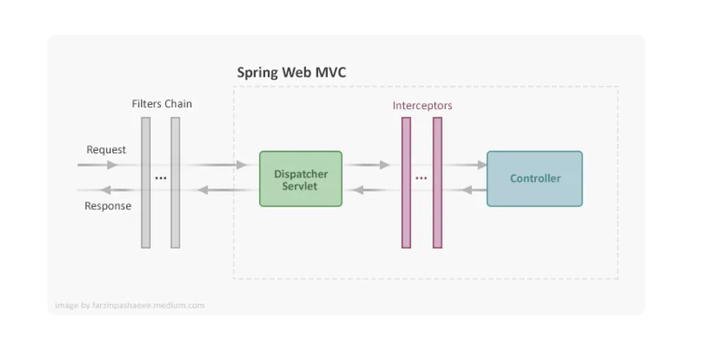

A **Spring Filter** is an interceptor that processes HTTP requests 
**before they reach a servlet** or controller.

Filters are useful for **security, logging, modifying requests/responses, 
and monitoring incoming requests.**

**How Spring Filters Work:**
1.	The client sends an HTTP request.
2.	The Filter intercepts the request before it reaches the Servlet (DispatcherServlet).
3.	The filter processes the request (e.g., authentication, logging, request modifications).
4.	The request is passed to the Controller.
5.	After the response is generated, the Filter can modify it before sending it back to the client.

## Types of Filters in Spring

### 1. Spring Security Filters

|Filter| Purpose|
|---|---|
|SecurityContextPersistenceFilter|Stores and restores authentication details from session|
|UsernamePasswordAuthenticationFilter|Handles login authentication using username & password|
|BasicAuthenticationFilter|Handles HTTP Basic Authentication|
|BearerTokenAuthenticationFilter|Extracts JWT tokens from the request header|
|ExceptionTranslationFilter|Converts security exceptions to proper responses|
|FilterSecurityInterceptor|Final filter to check user authorization|
|CsrfFilter|Prevents Cross-Site Request Forgery (CSRF) attacks|
|LogoutFilter|Handles user logout logic|
|RememberMeAuthenticationFilter|Supports “Remember Me” functionality|
|AnonymousAuthenticationFilter|Assigns anonymous identity to unauthenticated users|

### 2. Generic Servlet Filters (javax.servlet.Filter)

These are standard Java Servlet filters that work with any Java EE or Spring-based web application.

|Filter |Purpose|
|---|---|
|CharacterEncodingFilter|Ensures request encoding (UTF-8, etc.)|
|HiddenHttpMethodFilter|Converts PUT, DELETE, etc., from _method parameter|
|CorsFilter|Handles CORS (Cross-Origin Resource Sharing) requests|
|ShallowEtagHeaderFilter|Adds ETag headers to HTTP responses for caching|
|RequestContextFilter|Binds request attributes to RequestContextHolder|

### 3. Spring Boot-Specific Filters (OncePerRequestFilter)

Spring Boot provides an easy way to create custom filters by extending OncePerRequestFilter.
**OncePerRequestFilter ensures that the filter runs only once per request, even during internal forwarding.**

|Filter |Purpose|
|---|--|
|Custom Logging Filter|Logs request and response details|
|JWT Authentication Filter|Extracts and validates JWT tokens|
|IP Rate Limiting Filter|Restricts API requests per IP|
|Request Timing Filter|Measures request processing time|

