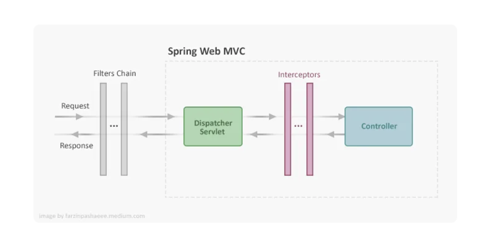

|Feature |Filter (javax.servlet.Filter)| Interceptor (HandlerInterceptor)|
|---|---|---|
|Runs Before Controller? |Yes (Before DispatcherServlet)|Yes (Before Controller Execution)
|Runs After Controller? |No |Yes (PostHandle & AfterCompletion)
|Can Modify Response? |Yes |Yes
|Runs for Static Resources? |Yes |No

A **Spring Filter** is an interceptor that processes HTTP requests 
**before they reach a servlet** or controller.

Filters are useful for **security, logging, modifying requests/responses, 
and monitoring incoming requests.**

**How Spring Filters Work:**
1.	The client sends an HTTP request.
2.	The Filter intercepts the request before it reaches the Servlet (DispatcherServlet).
3.	The filter processes the request (e.g., authentication, logging, request modifications).
4.	The request is passed to the Controller.
5.	After the response is generated, the Filter can modify it before sending it back to the client.


## Creating Custom Filter

You can create a filter in Spring Boot by implementing javax.servlet.Filter 
or extending OncePerRequestFilter.

###  Example 1: Logging Filter

**@WebFilter automatically registers the filter in a Spring Boot application.**

```java
import jakarta.servlet.Filter;
import jakarta.servlet.FilterChain;
import jakarta.servlet.ServletException;
import jakarta.servlet.ServletRequest;
import jakarta.servlet.ServletResponse;
import jakarta.servlet.annotation.WebFilter;
import java.io.IOException;

@WebFilter(urlPatterns = "/*") //TODO: Applies to all requests
public class LoggingFilter implements Filter {

    @Override
    public void doFilter(ServletRequest request, ServletResponse response, FilterChain chain)
            throws IOException, ServletException {
        
        System.out.println("Incoming Request: " + request.getRemoteAddr());
        
        // Continue processing the request
        chain.doFilter(request, response);
    }
}

```

### Registering a Filter Manually Using FilterRegistrationBean
   **(@WebFilter automatically registers-SpringBoot)**

```java
import org.springframework.boot.web.servlet.FilterRegistrationBean;
import org.springframework.context.annotation.Bean;
import org.springframework.context.annotation.Configuration;

@Configuration
public class FilterConfig {

    @Bean
    public FilterRegistrationBean<LoggingFilter> loggingFilter() {
        FilterRegistrationBean<LoggingFilter> registrationBean = new FilterRegistrationBean<>();
        registrationBean.setFilter(new LoggingFilter());
        registrationBean.addUrlPatterns("/api/*"); // Apply only to API endpoints
        registrationBean.setOrder(1); // Lower number = higher priority
        return registrationBean;
    }
}
```
### Register an Already implemented Filter.

#### Example 1:

Registering **CorsFilter:**

```java

import org.springframework.boot.web.servlet.FilterRegistrationBean;
import org.springframework.context.annotation.Bean;
import org.springframework.context.annotation.Configuration;
import org.springframework.web.cors.CorsConfiguration;
import org.springframework.web.cors.UrlBasedCorsConfigurationSource;
import org.springframework.web.filter.CorsFilter;
import java.util.List;

@Configuration
public class FilterConfig {

    @Bean
    public FilterRegistrationBean<CorsFilter> corsFilter() {
        UrlBasedCorsConfigurationSource source = new UrlBasedCorsConfigurationSource();
        CorsConfiguration config = new CorsConfiguration();
        
        config.setAllowedOrigins(List.of("http://localhost:3000"));
        config.setAllowedMethods(List.of("GET", "POST", "PUT", "DELETE"));
        config.setAllowedHeaders(List.of("Authorization", "Content-Type"));
        config.setAllowCredentials(true);
        
        source.registerCorsConfiguration("/**", config);

        FilterRegistrationBean<CorsFilter> filterRegistration = new FilterRegistrationBean<>(new CorsFilter(source));
        filterRegistration.setOrder(1); // Set priority (lower value = higher priority)
        
        return filterRegistration;
    }
}
```
#### Example 2:

Register **CharacterEncodingFilter:**

```java
import org.springframework.boot.web.servlet.FilterRegistrationBean;
import org.springframework.context.annotation.Bean;
import org.springframework.context.annotation.Configuration;
import org.springframework.web.filter.CharacterEncodingFilter;

@Configuration
public class EncodingFilterConfig {

    @Bean
    public FilterRegistrationBean<CharacterEncodingFilter> encodingFilter() {
        CharacterEncodingFilter filter = new CharacterEncodingFilter();
        filter.setEncoding("UTF-8");
        filter.setForceEncoding(true);

        FilterRegistrationBean<CharacterEncodingFilter> registrationBean = new FilterRegistrationBean<>(filter);
        registrationBean.setOrder(2); // Order after CORS filter
        
        return registrationBean;
    }
}
```

## Types of Filters in Spring

### 1. Spring Security Filters

|Filter| Purpose|
|---|---|
|SecurityContextPersistenceFilter|Stores and restores authentication details from session|
|UsernamePasswordAuthenticationFilter|Handles login authentication using username & password|
|BasicAuthenticationFilter|Handles HTTP Basic Authentication|
|BearerTokenAuthenticationFilter|Extracts JWT tokens from the request header|
|ExceptionTranslationFilter|Converts security exceptions to proper responses|
|FilterSecurityInterceptor|Final filter to check user authorization|
|CsrfFilter|Prevents Cross-Site Request Forgery (CSRF) attacks|
|LogoutFilter|Handles user logout logic|
|RememberMeAuthenticationFilter|Supports “Remember Me” functionality|
|AnonymousAuthenticationFilter|Assigns anonymous identity to unauthenticated users|

### 2. Generic Servlet Filters (javax.servlet.Filter)

These are standard Java Servlet filters that work with any Java EE or Spring-based web application.

|Filter |Purpose|
|---|---|
|CharacterEncodingFilter|Ensures request encoding (UTF-8, etc.)|
|HiddenHttpMethodFilter|Converts PUT, DELETE, etc., from _method parameter|
|CorsFilter|Handles CORS (Cross-Origin Resource Sharing) requests|
|ShallowEtagHeaderFilter|Adds ETag headers to HTTP responses for caching|
|RequestContextFilter|Binds request attributes to RequestContextHolder|

### 3. Spring Boot-Specific Filters (OncePerRequestFilter)

Spring Boot provides an easy way to create custom filters by extending OncePerRequestFilter.
**OncePerRequestFilter ensures that the filter runs only once per request, even during internal forwarding.**

|Filter |Purpose|
|---|--|
|Custom Logging Filter|Logs request and response details|
|JWT Authentication Filter|Extracts and validates JWT tokens|
|IP Rate Limiting Filter|Restricts API requests per IP|
|Request Timing Filter|Measures request processing time|


