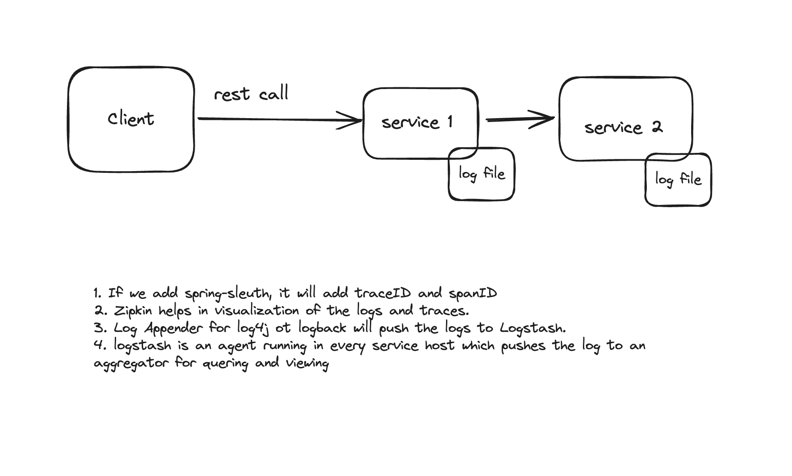

## Distributed Logging Features:
✔ Tracks requests across multiple services.</br>
✔ Adds Trace IDs to correlate logs.</br>
✔ Centralizes logs in Elasticsearch, Logstash, Kibana (ELK) or Graylog.</br>
✔ Supports log aggregation and structured logging (JSON format).</br>

**Explaination:**




* **Zipkin:** When a request flows through multiple microservices, Zipkin records the journey and visualizes the trace.
* **logstash:** Agent running in each host to aggregate and push the logs to Elasticsearch.
* **Kibana:** It is a visualization tool for exploring and analyzing logs, metrics, and traces stored in Elasticsearch.

## Steps to Configure Distributed Logging

### Pre-requisite:

1. **Run Elastic search and Kibana:**

```shell
docker network create elk_network

# Start Elasticsearch
docker run --name elasticsearch --net elk_network -p 9200:9200 -p 9300:9300 -e "discovery.type=single-node" -e "xpack.security.enabled=false" -d docker.elastic.co/elasticsearch/elasticsearch:8.0.0

# Start Kibana
docker run --name kibana --net elk_network -p 5601:5601 -e "ELASTICSEARCH_HOSTS=http://elasticsearch:9200" -d docker.elastic.co/kibana/kibana:8.0.0
```
2. **Logstsh should be running locally**

```shell
docker run -p 5000:5000
```

### For Log4j2 dependencies (recommended for better performance):

```xml
<dependency>
    <groupId>org.springframework.boot</groupId>
    <artifactId>spring-boot-starter-log4j2</artifactId>
    <exclusions>
        <exclusion>
            <groupId>org.springframework.boot</groupId>
            <artifactId>spring-boot-starter-logging</artifactId>
        </exclusion>
    </exclusions>
</dependency>
```


### Enable Spring Cloud Sleuth for Tracing

**Spring Cloud Sleuth automatically adds Trace ID and Span ID to logs.**

```xml
<dependency>
    <groupId>org.springframework.cloud</groupId>
    <artifactId>spring-cloud-starter-sleuth</artifactId>
</dependency>
```

**Configure Sleuth in application.properties**

```properties
# Enable tracing and log propagation
spring.application.name=order-service
logging.pattern.level=%5p [${spring.application.name}, TRACE-ID=%X{traceId}, SPAN-ID=%X{spanId}]
spring.sleuth.sampler.probability=1.0  # 100% sampling for tracing all requests
```

**Sample Output:(in log file)**

```log
INFO [order-service, TRACE-ID=abc123, SPAN-ID=xyz789] Order created successfully
INFO [payment-service, TRACE-ID=abc123, SPAN-ID=def456] Payment processed
```
### Adding dependencies to convert the lof]g to json :

```xml
<dependency>
    <groupId>org.apache.logging.log4j</groupId>
    <artifactId>log4j-layout-template-json</artifactId>
    <version>2.17.1</version> <!-- Use the latest version -->
</dependency>
```
### log4j.xml to send logs to logstash:

```xml
<?xml version="1.0" encoding="UTF-8"?>
<Configuration status="WARN">
    <Appenders>
        <!-- Console Appender -->
        <Console name="Console" target="SYSTEM_OUT">
            <PatternLayout pattern="%d{yyyy-MM-dd HH:mm:ss} [%t] %-5level %logger{36} - %msg%n" />
        </Console>

        <!-- Logstash TCP Appender -->
        <Socket name="Logstash" host="localhost" port="5000">
            <JsonLayout compact="true" eventEol="true" complete="true"/>
        </Socket>
    </Appenders>

    <Loggers>
        <Root level="info">
            <AppenderRef ref="Console"/>
            <AppenderRef ref="Logstash"/>
        </Root>
    </Loggers>
</Configuration>
```

### Configure Logstash to accept logs:

create Logstash.conf

```bash
input {
  tcp {
    port => 5000
    codec => json
  }
}

filter {
  # Add filters if needed, e.g., remove unwanted fields
}

output {
  stdout { codec => rubydebug }  # Print logs to console for debugging

  # Forward logs to Elasticsearch (if needed)
   elasticsearch {
     hosts => ["http://localhost:9200"]
     index => "spring-logs"
   }
}
```

### run logstash :

```shell
logstash -f logstash.conf
```


### Configure Zipkin in application.yml

**Sleuth will automatically generate tracing logs, and we send them to Zipkin.**

```properties
spring.application.name=my-service

# Zipkin Configuration
spring.zipkin.base-url=http://localhost:9411

# Sleuth Configuration
spring.sleuth.sampler.probability=1.0  # 100% tracing in development (reduce in production)

# Logging Configuration
logging.level.root=debug
```

## Forwarding the logs form Logstash to Elastic Search:

already done in Configure Logstash to accept logs: </br>
<< Search for "# Forward logs to Elasticsearch (if needed)">>


